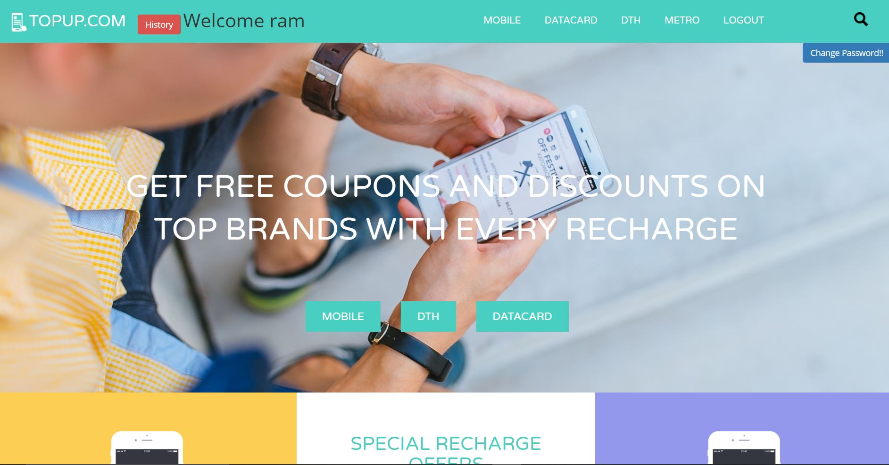
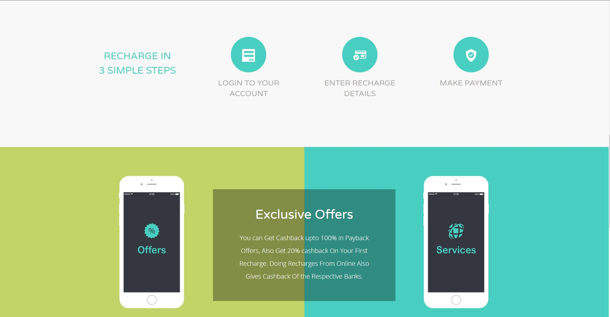
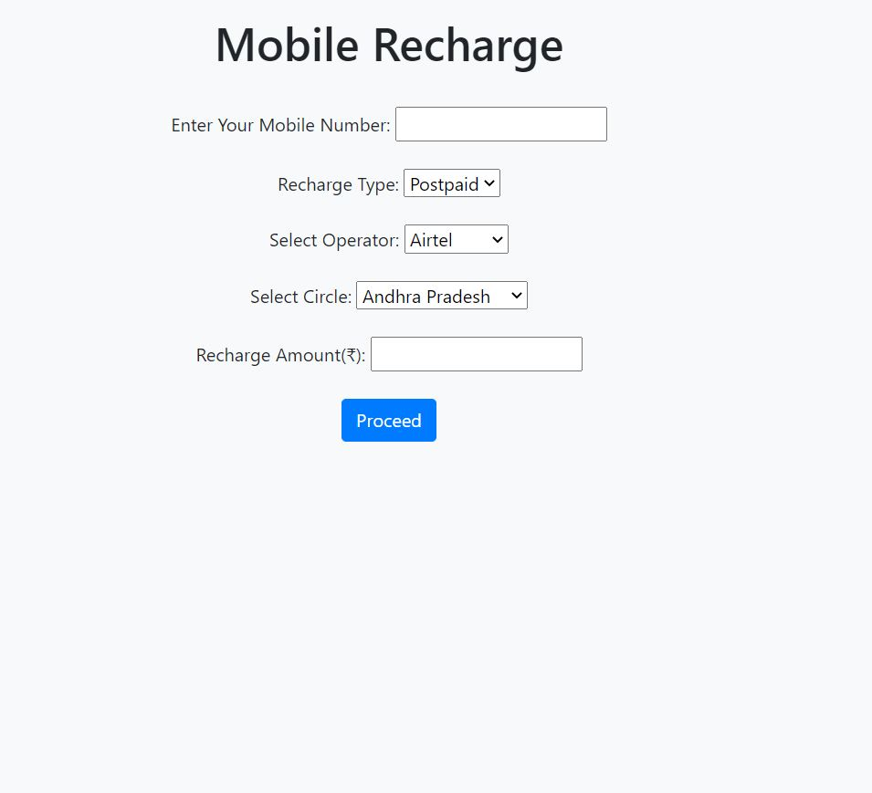
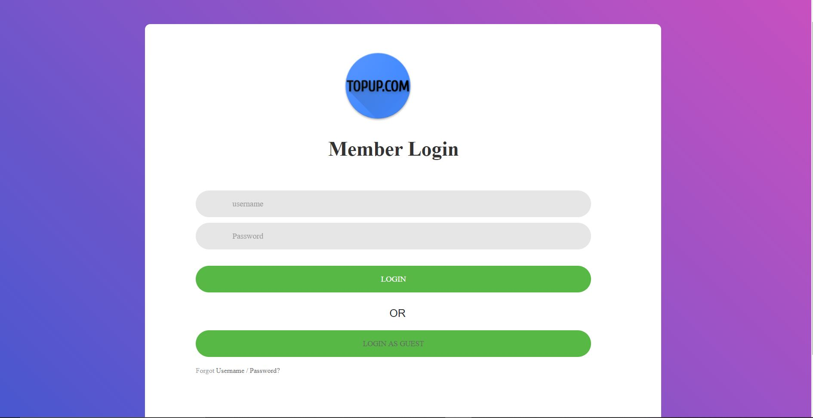
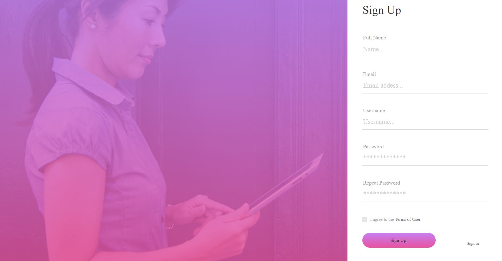
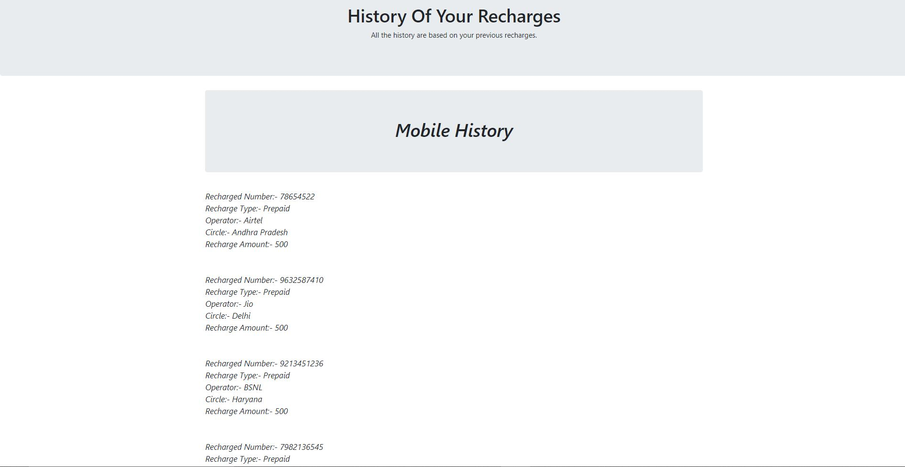

# TOPUP
It's a Online Recharge Site Like Paytm and Freecharge
  
<b>This is the Alluring Home Page Of Our Website , Which Requires lots Of improvements & Updation. Since It's An Prototype!!</b>
 
 
  TOPUP | Python, Django, Html, Css, Bootstrap
  
 Features:-
 1. Developed a full-stack web application using with Django 2 with HTML, CSS, Bootstrap as the frontend.
 2. Capable of all the Authentication stuff.
 3. Added history Analysis & Searching Functionality.
 4. Used PostgreSQL for Faster Query Processing and Response.

    
<b> This is another image of Our homepage which mostly focus On 4 Types Of Recharges. 
  These are
  1. Mobile
  2. Dth.
  3. Metro.
  4. Datacard.
  
  
 
  
     
I am Sharing Screenshot Of one the Recharge

   
Now This is the Login and Register Page of Our Website in which User can add there respective account and easily Login in there accounts. 

     
  
     
Apart From this there is a Features of History where User can go and check all there Previous done Recharges, Along with this Also added Searching Functionality To Search for particular Recharge as Well

  
  </b>

